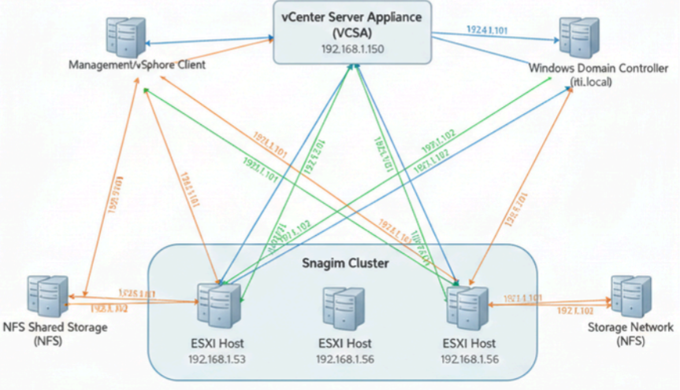

# 🌩️ Enterprise vSphere Resilience Architecture

## 📌 Project Overview
This project demonstrates the design and deployment of a highly available, enterprise-grade VMware vSphere infrastructure. The core objective is to build a **"Self-Healing"** data center that automatically mitigates hardware failures, eliminates single points of failure, and optimizes resource utilization through intelligent workload distribution.

## ✨ Key Features & Capabilities
* **High Availability (HA):** Automated disaster recovery that instantly restarts virtual machines on healthy hosts if a physical server fails.
* **Fault Tolerance (FT):** Zero-downtime protection for mission-critical VMs through a live, continuously synchronized "Shadow VM".
* **Distributed Resource Scheduler (DRS):** Fully automated, intelligent load balancing of CPU and Memory workloads across the entire cluster.
* **Zero-Downtime Migration (vMotion):** Seamless live migration of running workloads between physical servers without service interruption.
* **Centralized Identity Management:** Active Directory (LDAP) integration for Single Sign-On (SSO) and Role-Based Access Control (RBAC).

## 🏗️ Infrastructure Topology

*The architecture utilizes a multi-layered approach (Management, Compute, Storage, and Network) to ensure maximum scalability and resilience.*

## 🚀 Implementation Steps (Workflow)
Here is the step-by-step execution process followed to build this infrastructure from scratch:

### Phase 1: Core Infrastructure Deployment
1. **Hypervisor Installation:** Deployed VMware ESXi 6.7 on three bare-metal hosts (192.168.1.53, .55, .56).
2. **Centralized Management:** Installed and configured the **vCenter Server Appliance (VCSA)** to act as the central management hub for the data center.

### Phase 2: Networking & Shared Storage
3. **VMkernel Networking:** Configured dedicated vSwitches and VMkernel adapters to isolate Management, vMotion, and FT Logging traffic securely.
4. **NFS Shared Storage:** Deployed a Linux-based NFS server and mounted it across all ESXi hosts to serve as a unified datastore (`NFS_Shared_DS`), which is mandatory for HA and vMotion functionality.

### Phase 3: Cluster Configuration & Automation
5. **Cluster Creation:** Aggregated the three ESXi hosts into a unified, high-performance compute resource named the **"Snagim Cluster"**.
6. **Enabling DRS & HA:** Activated "Fully Automated" DRS for load balancing, and enabled Host Monitoring (HA) for rapid failover protection.

### Phase 4: Resilience & Security Integration
7. **Fault Tolerance (FT) Setup:** Configured a secondary host for mission-critical VMs to ensure continuous synchronization and zero downtime during hardware failures.
8. **Active Directory Integration:** Joined the VCSA to the corporate domain (`iti.local`), configured Identity Sources, and assigned global administrative permissions to domain users.

## 🛠️ Tech Stack & Tools
* **Hypervisor:** VMware ESXi 6.7
* **Management:** vCenter Server Appliance (VCSA) 6.7
* **Storage:** Network File System (NFS) on Linux (RHEL/CentOS)
* **Security & Identity:** Microsoft Active Directory (Windows Server)
* **Guest OS:** Red Hat Fedora Workstation

---
*Architected and deployed by Assem Ragab, Emad Elsayed Singab, and Mohamed Mostafa Nada under the supervision of Eng. Ekram Abdelwahab (Information Technology Institute - ITI).*
